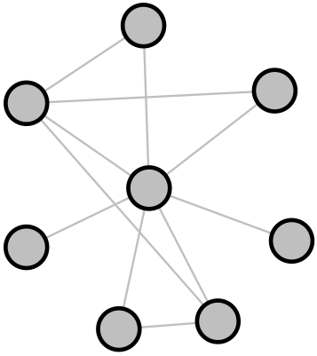
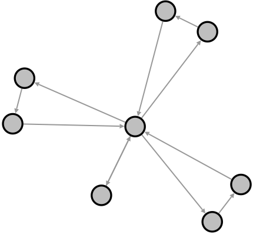

# PathLims – Ultra-Short and Ultra-Long Network Generation

PathLims is a package to study and generate networks with largest and shortest possible average pathlength (or largest and smallest global efficiencies). Networks are treated as adjacency matrices, represented as 2D NumPy arrays. Python 2.7 and 3.X compatible.

The package contains three modules:

- *limits.py*: Analytic expressions to calulate the boundaries of average pathlength and global efficiency for networks of arbitrary size and number of links.
- *generators.py*: Functions to create ultra-short and ultra-long networks, of arbitrary size and number of links.
- *helpers.py*: Miscellaneous helper functionalities. Needed to run the examples.

Visit the help of each module for a complete list of functions.

> **NOTE:** PathLims is fully compatible with [pyGAlib](https://github.com/gorkazl/pyGAlib), a library for graph analysis in Python/Numpy, but it can be used independently. 

#### Reference and citation

For a complete description of the boundaries for the average pathlength and global efficiency, and for a illustration of ultra-short / ultra-long network generation, see:

- G. Zamora-López & R. Brasselet "[Sizing complex networks](https://doi.org/10.1038/s42005-019-0239-0)" *Commun. Phys.* **2**:144 (2019).

Please cite the above reference if you use PathLims.
Results for some special cases (connected and undirected graphs) can also be found in: D. Barmpoutis & R.M. Murray "*Extremal Properties of Complex Networks*"
arXiv:1104.5532v1 (2011); and L. Gulyas, et al. "*An Estimation of the Shortest and Largest Average Path Length in Graphs of Given Density*"
arXiv:1101.2549v1 (2011).

### INSTALLATION

Installation of ÜathLims is simple. An existing python distribution and the [pip](https://github.com/pypa/pip) package manager need to be installed. If Python was installed via the [Canopy](https://www.enthought.com/product/canopy/) or the [Anaconda](https://www.anaconda.com) distributions, then `pip` is surely installed. To check, open a terminal and type:

	$ pip --help

**- The simple installation**: PathLims is registered in [PyPI](https://pypi.org/project/pathlims/) (the Python Packages Index), therefore installation from the terminal is straight forward. `pip` will automatically take care of the  dependencies (see the *requirements.txt* file). Simply type:

	$ pip install galib 

To confirm the installation open an interactive session and try to import the library by typing `import pathlims`.

> **NOTE:** If you are using Python 2 and Python 3 environments, PathLims needs to be installed in each of the environments separately.

**- Installation from GitHub (lazy version)**: If [git](https://git-scm.com) is also installed in your computer, then open a terminal and type:

	$ pip install git+https://github.com/gorkazl/PathLims.git@master

This will install the package, that is, the content in the folder *pathlims/*. Other files (Examples/, README.md, LICENSE.txt, etc.) need to be downloaded manually, if wanted.

**- Installation from GitHub (full download)**: Visit the GitHub repository [https://github.com/gorkazl/PathLims/](https://github.com/gorkazl/PathLims/) and click on the "Clone or download" button at the right hand side (the green button). Select "Download ZIP". Unzip the file, open a terminal and move to the folder, e.g.,

	$ cd ~/Downloads/PathLims-master/

Once on the folder that contains the *setup.py* file, type the following

	$ pip install .

Do not forget the "." at the end which means "*look for the setup.py file in the current directory*." This will check for the dependencies and install PathLims. 

> **NOTE**: After installation the current folder "*~/Downloads/PathLims-master/*" can be safely deleted, or moved somewhere else if you want to conserve the examples and the tests.

### HOW TO USE PathLims

Since PathLims depends on NumPy, it is recommended to import NumPy first. Although this is not necessary for loading the package, NumPy functionalities and array manipulation will be often needed. Try importing pathlims:

	>>> import numpy as np
	>>> import pathlims

> **NOTE**: Importing pathlims imports also the two main modules, *limits* and *generators* into the namespace. They can be called as `pathlims.limits`and `pathlims.generators`

##### Example 1 – Ultra-short graph

Let's generate an ultra-short graph of *N = 8* nodes and *L = 11* edges. We will use the random connectivity case:

	>>> import numpy as np
	>>> import pathlims
	>>> N = 8; L = 11
	>>> usnet = pathlims.generators.USgraph(N,L, uscase='Random')
	>>> print(usnet)
	array([[0, 1, 1, 1, 1, 1, 1, 1],
		[1, 0, 0, 1, 0, 0, 1, 0],
		[1, 0, 0, 0, 0, 0, 0, 0],
		[1, 1, 0, 0, 0, 0, 0, 0],
		[1, 0, 0, 0, 0, 0, 1, 0],
		[1, 0, 0, 0, 0, 0, 1, 0],
		[1, 1, 0, 0, 1, 1, 0, 0],
		[1, 0, 0, 0, 0, 0, 0, 0]], dtype=uint8)

The first node corresponds to the central hub in the initial star graph. The presence of this hub guarantees the diameter of the network to be diam(G) = 2. The remaining 4 edges are seeded at random. 

Let's calculate, numerically, the average pathlength of this network. For this we use the `FloydWarshall()` function in the *helpers.py* module to calculate the pairwise distance matrix:

	>>> import pathlims.helpers
	>>> dij = pathlims.helpers.FloydWarshall(usnet)
	>>> avlen = ( dij.sum() - dij.trace() ) / ( N*(N-1) )
	>>> print( avlen )
	1.60714285714

The global efficiency is calculated as the average of the inverse of the distances:

	>>> eij = 1.0 / dij
	>>> effic = ( eij.sum() - eij.trace() ) / (N*(N-1))
	>>> print (effic )
	0.696428571429

We now corroborate that the numerical results match the theoretical estimations:

	>>> pathlims.limits.Pathlen_USgraph(N,L)
	1.6071428571428572
	>>> pathlims.limits.Effic_USgraph(N,L)
	0.6964285714285714

##### Example 2 – Sparse ultra-short digraphs (directed graph)

In the range *N ≤ L ≤ 2(N-1)* connected digraphs with shortest pathlength possible are characterised by a particular class of networks, **flower digraphs**, which consist of a small set of directed cycles all overlapping in a single node. We generate the flower digraph with *N = 8* nodes and *L = 11* arcs:

	>>> fdnet = pathlims.generators.USdigraph_FlowerDigraph(N,L)
	>>> fdnet
	array([[0, 1, 1, 0, 1, 0, 1, 0],
		[1, 0, 0, 0, 0, 0, 0, 0],
		[0, 0, 0, 1, 0, 0, 0, 0],
		[1, 0, 0, 0, 0, 0, 0, 0],
		[0, 0, 0, 0, 0, 1, 0, 0],
		[1, 0, 0, 0, 0, 0, 0, 0],
		[0, 0, 0, 0, 0, 0, 0, 1],
		[1, 0, 0, 0, 0, 0, 0, 0]], dtype=uint8)
		       

The average pathlenth and gloal efficiency are numerically calculated as before:

	>>> dij = pathlims.helpers.FloydWarshall(fdnet)
	>>> avlen = ( dij.sum() - dij.trace() ) / ( N*(N-1) )
	>>> print(avlen)
	2.33928571429
	>>> eij = 1./dij
	>>> effic = ( eij.sum() - eij.trace() ) / (N*(N-1))
	>>> print(effic)
	0.5178571428571429

Finally, we corroborate that the numerical results match the theoretically expected values:

	>>> pathlims.limits.Pathlen_FlowerDigraph(N,L)
	2.3392857142857144
	>>> pathlims.limits.Effic_FlowerDigraph(N,L)
	0.51785714285714302

##### Data I/O

Since PathLims is based on NumPy arrays, saving and reading of adjacency matrices, can be performed using the usual data I/O functionalities of NumPy. See for example the documentation for functions: `loadtxt()`, `savetxt()`, `load()`, `save()` and `savez()`. 
See also he *tools.py* module in pyGAlib for other data conversions.

#### How to find further documentation

While working in an interactive session, after importing a module, the built-in `help()` function will show further details:

	>>> import modulename
	>>> help(modulename)

The help for PathLims (`help(pathlims)`) shows the general summary of the package and a list of all the modules in the library. The help for each module, e.g., `help(pathlims.limits)` or `help(pathlims.generators)` will display module specific information and a list of all the functions in the module.
For further details regarding each function, type:

	>>> help(pathlims.modulename.functionname)

For IPython and Jupyter notebook users the help command is replaced by a question mark after the module's or function's name, e.g.:

	>>> modulename?
	>>> functionname?

For questions, bug reports, etc, please write to <galib@Zamora-Lopez.xyz>, or open an issue in GitHub.

### LICENSE
Copyright 2018 - 2019, Gorka Zamora-López <gorka@Zamora-Lopez.xyz>

Licensed under the Apache License, Version 2.0 (the "License");
you may not use this software except in compliance with the License.
You may obtain a copy of the License at

[http://www.apache.org/licenses/LICENSE-2.0](http://www.apache.org/licenses/LICENSE-2.0)

Unless required by applicable law or agreed to in writing, software
distributed under the License is distributed on an "AS IS" BASIS,
WITHOUT WARRANTIES OR CONDITIONS OF ANY KIND, either express or implied.
See the License for the specific language governing permissions and
limitations under the License.

-----------------------------------------------------------------
### WHAT IS NEW

##### November 22, 2019
Stable version 1.0.0 checked, validated and released.

##### December 31, 2018
Example scripts have been added and some datasets:

- Two scripts (*EmpiricalNets_Directed.py* and *EmpiricalNets_Undirected.py*) to illustrate how to compare the pathlength and efficiency of real networks to those of ring lattices, random graphs and the true ultra-long and ultra-short limits.
- Four scripts (*UltraLong_Digraphs.py*, *UltraLong_Graphs.py*, *UltraShort_Digraphs.py* and *UltraShort_Graphs.py*) in which ultra-long and ultra-short networks are generated, their pathlength and efficiencies  are numerically calculated, and compared to the theoretical values for corroboration. 

##### December 22, 2018
Version 1.0.0 beta of PathLims has been uploaded.
 

